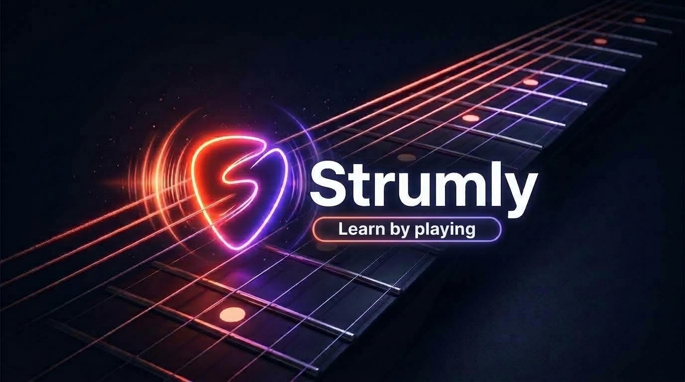

<p align="center">
  
</p>

<p align="center">
  <a href="#-status"></a>
  
  
  
  
  
  
  
</p>

---

> [!WARNING]
> ### 🚧 Projeto em Construção (Work in Progress)
> O **Strumly** está em fase ativa de desenvolvimento e calibração. Estamos refinando a detecção por pitch DSP para mais timbres de violão acústico e elétrico, além de expandir o catálogo de lições e modos de treino gamificados. Feedbacks e contribuições são super bem-vindos!

---

# 🎸 Strumly — Learn by playing

Uma plataforma web interativa e gamificada para aprendizado de violão inspirada na energia de **Rocksmith** e **Guitar Hero**, utilizando **violão de verdade** (acústico pelo microfone ou elétrico por interface USB/P10).

## 🌟 Principais Funcionalidades

- 🎙️ **Detecção de Notas em Tempo Real (DSP)**:
  - Algoritmo de pitch detection **YIN** com interpolação parabólica sub-bin (< 0.02 Hz de erro).
  - Filtro dinâmico de ruído ambiente (*Noise Gate* adaptativo).
  - Mapeamento das 6 cordas do violão (E2, A2, D3, G3, B3, E4) e trastes (0 a 12).
- 🎸 **Braço 3D Estilo Rocksmith (WebGL)**:
  - Braço de violão 3D renderizado em perspectiva com Three.js / React Three Fiber.
  - 15 trastes matematicamente escalonados com marcadores perolados (inlays).
  - Cores canônicas nas 6 cordas:
    - 🔴 **6ª Corda (E2)**: Vermelho
    - 🟡 **5ª Corda (A2)**: Amarelo
    - 🔵 **4ª Corda (D3)**: Azul
    - 🟠 **3ª Corda (G3)**: Laranja
    - 🟢 **2ª Corda (B3)**: Verde
    - 🟣 **1ª Corda (E4)**: Roxo
  - Destaque iluminado na corda e casa alvo, com simulação física de vibração nas cordas.
- 🎛️ **Afinador Integrado**:
  - Medidor analógico em arco (-50 a +50 cents) e digital.
  - Detecção automática de corda ou seleção manual.
  - Indicador neon verde de afinação precisa (±4 cents).
- 📚 **Catálogo de Lições Progressivo**:
  1. *Cordas Soltas Básicas*: Treino de ritmo e calibração das 6 cordas soltas.
  2. *Primeiros Trastes*: Exercício cromático 1-2-3 na 6ª e 5ª cordas.
  3. *Primeiro Riff*: Riff clássico (*Smoke on the Water* simplificado).
  4. *Acordes Introdutórios*: Arpejo de Mi Menor (Em) e Lá Suspenso (Asus2).
- 🏆 **Gamificação & HUD**:
  - Multiplicador de combo dinâmico (1x a 4x), streak, precisão percentual e avaliação final por estrelas (1 a 3) com confetes.
  - Suporte auxiliar para testar no teclado (`Espaço` / `Enter`) mesmo sem violão físico por perto.

---

## 🚀 Tecnologias

- **Frontend**: React 19 + TypeScript + Vite
- **Estilização**: Tailwind CSS v4 + Lucide Icons
- **3D & Gráficos**: Three.js + React Three Fiber + Drei
- **Áudio & DSP**: Web Audio API (baixa latência `interactive`)
- **Estado Global**: Zustand
- **Efeitos**: Canvas Confetti

---

## 🛠️ Como Executar

### Pré-requisitos
- Node.js 18+ instalado

### Instalação e Execução
```bash
# Instalar dependências
npm install

# Iniciar servidor de desenvolvimento
npm run dev
```

Abra no navegador em [http://localhost:5173](http://localhost:5173).

> 💡 **Dica de Uso**: Recomendamos fortemente o uso de **fones de ouvido** durante o jogo para evitar que o áudio das caixas de som vaze no microfone gerando falsas detecções (*audio bleed*).

